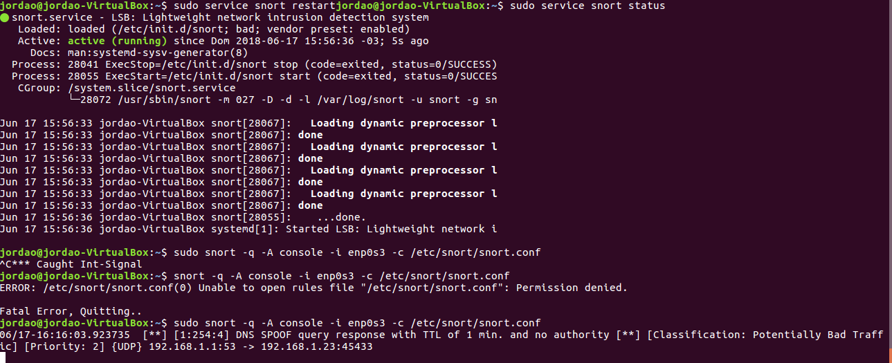
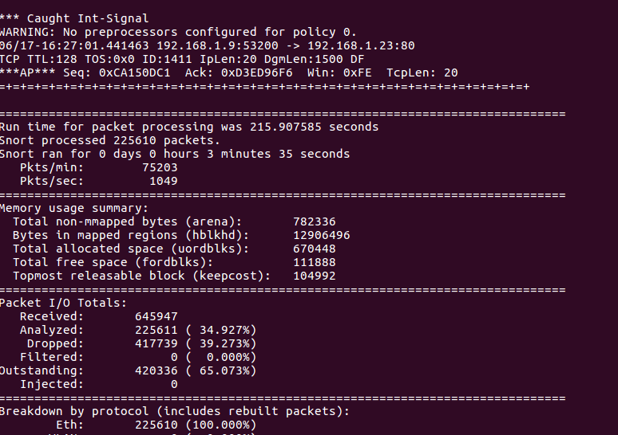

# Atividade IDS

- A atividade é interessante, pois mostra que é possível monitorar uma rede interna e detectar uma possível invasão.
- Aprendi tudo que tinha nessa atividade, pois nunca tinha tido contato com isso.

## Screenshots

