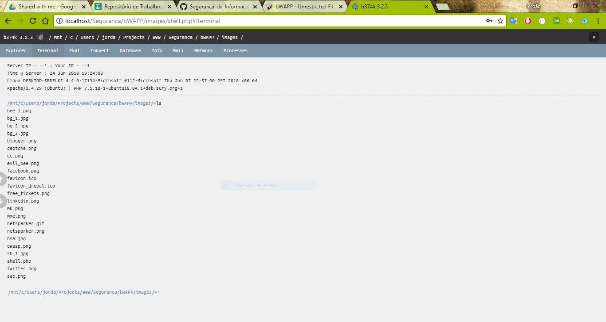

- Nessa atividade, aprendi um pouco sobre ambas as ferramentas utilizadas. Já conhecia um pouco sobre a bWAPP, mas não o recurso de inclusão de arquivos.
- Tive dificuldades para configurar o ambiente, mas isso era problema na minha máquina.

---------------
# Screenshots

