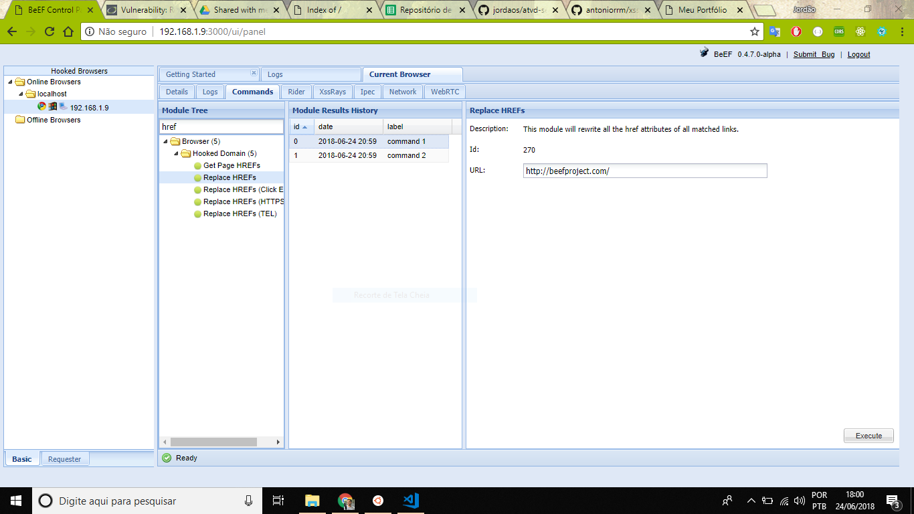
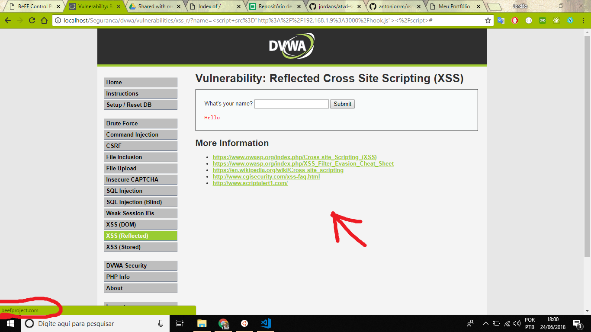

Link da atividade: https://github.com/antoniorrm/xss-pratica-seguranca

- Nessa atividade aprendi mais sobre o BEEF! Na atividade passada, a ferramenta não havia sido muito explorada. Aqui pude ver a força de um ataque XSS! 
- Achei muito legal, porém não consegui testar todas as funcionalidades (como usar a câmera).
- Fiz um teste de substituir os links, e deu certo, como pode ser visto na imagem abaixo.

---------------------
#Screenshots

