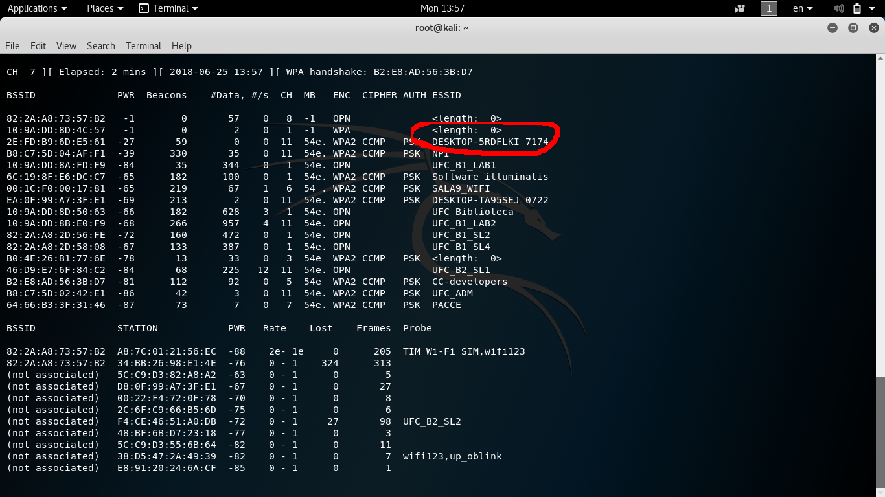
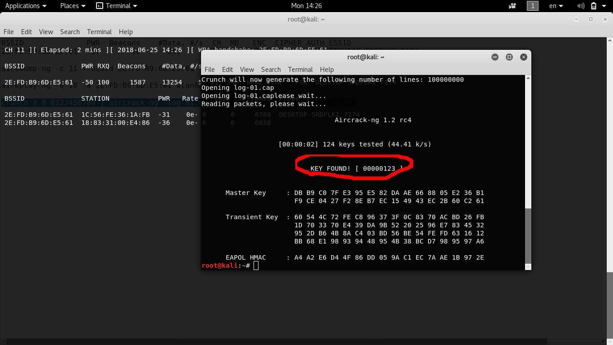

Fiz com o Leo Jaimesson.

- Nessa atividade aprendi conceitos de coisas básicas de Redes como WPA2
- Aprendi a instalar o Kali Linux, qua ainda não tinha instalado (sem ser no Virtual Box)
- Tivemos dificuldades para realizar a prática na parte de identificação da rede a ser invadida. Mas criamos uma a partir do meu computador e consegui fazer o Hack.
- Conseguimos encontrar a senha do WiFi.

-------------
# Screenshots

